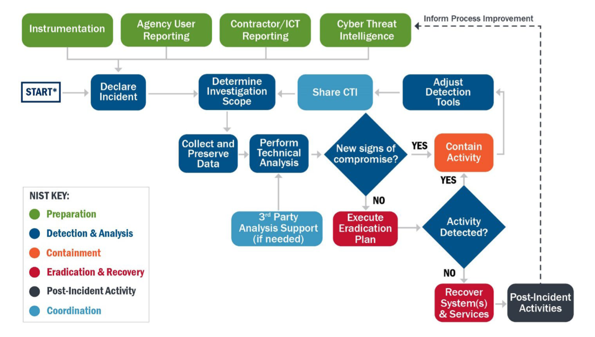

---
layout:
  title:
    visible: true
  description:
    visible: false
  tableOfContents:
    visible: true
  outline:
    visible: true
  pagination:
    visible: true
---

# Cyber Security Playbooks

### Introduction

Cybersecurity playbooks are essential for incident investigations, providing a structured, repeatable, and efficient framework to address security threats within an organisation. They outline predefined steps, detection techniques, and response strategies, enabling security teams to effectively identify, analyse, and mitigate incidents. By leveraging advanced query languages like KQL in tools such as Microsoft Defender and Sentinel, playbooks enhance the ability to uncover malicious activities, correlate threat intelligence, and streamline investigations. Their use fosters consistency in handling incidents, reduces response times, and minimises the impact of breaches. It also serves as a valuable resource for training and preparedness in an evolving threat landscape.

The following are some playbooks that can assist as a starting point for your KQL-based investigations:

### Triage & Investigation 

The triage and investigation process is a critical component of effective cybersecurity operations, focused on quickly identifying, prioritising, and analysing potential security incidents to minimise risk and impact. Triage involves the initial assessment of alerts to determine their severity, validity, and urgency, enabling teams to focus on the most critical threats. Investigation dives deeper into the identified incidents, uncovering the root cause, scope, and potential impact and guiding appropriate response actions.

Playbooks are pivotal in these processes by providing standardised, step-by-step guidance tailored to specific incidents. They streamline triage by defining clear criteria for alert prioritisation and validating suspected threats, ensuring consistency and reducing false positives. During an investigation, playbooks offer predefined queries, analysis methods, and workflows, empowering analysts to uncover indicators of compromise, trace attack vectors, and correlate events efficiently. By reducing ambiguity and improving response times, playbooks enhance the overall effectiveness of triage and investigation while supporting continuous learning and operational improvement.

### Incident Response Workflow 

<figure><figcaption></figcaption></figure>

The incident response process is a cornerstone of effective cybersecurity operations, designed to detect, contain, mitigate, and recover from security incidents in a systematic and efficient manner. It follows a structured approach, typically involving preparation, detection, analysis, containment, eradication, recovery, and post-incident review, to minimise the impact of incidents on organisational operations and assets.

Playbooks are vital tools that enhance the incident response process by providing predefined, step-by-step procedures tailored to specific types of incidents. They offer clear guidance on detecting and analysing threats, escalating issues, and executing containment and remediation actions, ensuring consistency and reducing response times. By incorporating advanced detection techniques, such as KQL queries for platforms like Microsoft Defender and Sentinel, playbooks help responders quickly identify indicators of compromise, trace attack vectors, and understand the scope of an incident. Playbooks also promote coordination among teams, standardise communication workflows, and support compliance with regulatory and organisational requirements. Ultimately, they enable security teams to respond to incidents more effectively and learn from each event to strengthen defences over time.

### Threat Hunting

The threat hunting process is a proactive cybersecurity activity focused on identifying potential threats that have evaded traditional detection methods. It involves exploring data across an organisation to uncover hidden malicious activities, anomalies, or indicators of compromise before they escalate into significant incidents. Threat hunting leverages a hypothesis-driven approach, using intelligence, patterns, and known tactics to identify and mitigate risks early in the attack lifecycle.

Playbooks are invaluable tools in the threat hunting process, providing predefined strategies, queries, and workflows that guide hunters in systematically analysing data and pursuing hypotheses. They ensure consistency in methodologies, help analysts cover all potential attack surfaces, and reduce the time needed to uncover hidden threats. By including advanced detection techniques, such as KQL queries for platforms like Microsoft Defender and Sentinel, playbooks enable hunters to efficiently sift through large datasets, identify anomalies, and trace complex attack chains. Additionally, playbooks support documentation and collaboration by outlining processes and findings, contributing to organisational learning and improving future threat hunting efforts.

### Vulnerability Response 

<figure><figcaption></figcaption></figure>

The vulnerability response process is a critical element of an organisation’s cybersecurity strategy. It is focused on identifying, assessing, prioritising, and remediating vulnerabilities across systems, applications, and networks. It aims to reduce the attack surface by addressing security weaknesses before adversaries can exploit them. The process includes activities such as vulnerability scanning, risk assessment, patch management, and validation to ensure an organisation maintains a strong security posture.

Playbooks significantly enhance the vulnerability response process by providing structured and repeatable workflows for handling vulnerabilities. They define clear steps for assessing the criticality of vulnerabilities, prioritising remediation efforts based on risk, and effectively implementing patches or mitigation strategies. Playbooks also include predefined queries and automated tasks for identifying vulnerable assets, tracking remediation progress, and verifying fixes. By standardising the process, playbooks improve efficiency, consistently apply best practices, and reduce human error. Additionally, they enable better collaboration between teams, faster response times, and compliance with regulatory requirements while supporting continuous improvement in vulnerability management practices.
